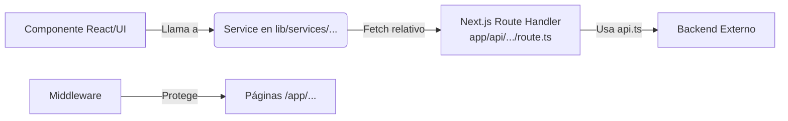

# Flujo de Creación de Endpoints

Este documento describe el flujo estándar para crear y consumir endpoints en el proyecto, siguiendo la arquitectura **Frontend Service -> Next.js Route Handler (BFF) -> Backend API**.

El patrón utiliza un sistema de "Backend for Frontend" (BFF) donde el cliente (navegador) llama a su propio servidor de Next.js (`/app/api/...`) y este a su vez se comunica con el backend real, manejando la autenticación y los tokens de forma segura.

## Diagrama de Flujo



---

## 1. Definición del Servicio en el Frontend (`src/lib/services/`)

El primer paso es crear o editar un archivo de servicio que será utilizado por los componentes de React. Este servicio realiza una petición HTTP a la ruta interna de Next.js (el Proxy/BFF), **NO** directamente al backend externo desde el navegador.

**Ubicación sugerida:** `src/lib/services/<nombre-dominio>.ts` (ej: `reports.ts`)

**Formato del Archivo:**

```typescript
import axios from "axios";
// Importar tipos si es necesario
import { MiTipoDeRespuesta } from "@/app/types/...";

export const obtenerDatosEjemplo = async (paramatros: any) => {
  // Nota: La URL es relativa (/api/...), apuntando al servidor de Next.js
  const response = await axios.get("/api/midominio/mi-recurso", {
    params: paramatros,
  });
  return response;
};

export const descargarExcelEjemplo = async (params: any) => {
  const response = await axios.get("/api/midominio/excel", {
    params,
    responseType: "blob", // Importante para descargas de archivos
  });
  return response;
};
```

---

## 2. Creación del Route Handler (`src/app/api/.../route.ts`)

Este archivo actúa como intermediario (Proxy). Se ejecuta en el servidor de Next.js. Su función principal es recibir la petición del frontend, adjuntar las credenciales (cookies/tokens) utilizando la instancia configurada `api`, y reenviar la petición al Backend real.

**Ubicación:** `src/app/api/<grupo>/<recurso>/route.ts`

**Dependencia clave:** Debe importar `api` desde `@/lib/services/api`.

**Formato del Archivo:**

```typescript
import { NextRequest, NextResponse } from "next/server";
import api from "@/lib/services/api";

const GET = async (req: NextRequest) => {
  try {
    // 1. Extraer parámetros de búsqueda (Search Params) si es necesario
    const searchParams = req.nextUrl.searchParams;
    const params: Record<string, string | string[]> = {};

    searchParams.forEach((value: string, key: string) => {
      const current = params[key];
      if (current === undefined) {
        params[key] = value;
      } else if (Array.isArray(current)) {
        params[key] = [...current, value];
      } else {
        params[key] = [current, value];
      }
    });

    // 2. Llamada al Backend Real usando 'api'
    const res = await api.get("/ruta/endpoint-backend/", {
      params,
    });

    if (res.status === 200) {
      return NextResponse.json(res.data, { status: res.status });
    } else {
      return NextResponse.json({ error: res.data }, { status: res.status });
    }

  } catch (e: any) {
    console.error(e);
    return NextResponse.json(
      { error: "Error en el servidor, favor intentelo más tarde" },
      { status: 500 }
    );
  }
};

const POST = async (req: NextRequest) => {
  try {
    const body = await req.json();
    
    const res = await api.post("/ruta/endpoint-backend/", body);
    
    if (res.status === 200 || res.status === 201) {
      return NextResponse.json(res.data, { status: res.status });
    } else {
      return NextResponse.json({ error: res.data }, { status: res.status });
    }
  } catch (e: any) {
    console.error(e);
    return NextResponse.json({ error: "Error en el servidor" }, { status: 500 });
  }
};

export { GET, POST };
```
##Example de login
```typescript
import { NextRequest, NextResponse } from "next/server";

import api from "@/lib/services/api";


const POST = async (request: NextRequest) => {
  try{
    const credentials = await request.json();
    const res = await api.post('/auth/login/', credentials);
    if (res.status === 200){
      const { access, refresh } = res.data;
      const response = NextResponse.json( "Success",{ status: 200 });
      response.headers.append('Access-Control-Allow-Credentials', 'true');
      response.cookies.set('accessToken', access, { httpOnly: true, path: '/', sameSite: 'lax', secure: true });
      response.cookies.set('refreshToken', refresh, { httpOnly: true, path: '/', sameSite: 'lax', secure: true });
      return response;
    } ;
    return NextResponse.json({ error: res.data }, { status: res.status });
  } catch (e) {
    console.error(e);
    return NextResponse.json({ error: "Error en el servidor, favor intentelo más tarde" }, { status: 500 });
  }
};

export { POST };
```


---

## 3. Referencia: Configuración Core (`src/lib/services/api.ts`)

Este archivo (`api.ts`) es el corazón de la comunicación Servidor-a-Servidor (Next.js -> Backend). **No se debe modificar para agregar endpoints**, sino que se usa como herramienta en los `route.ts`.

**Responsabilidades de `api.ts`:**
1.  **Configuración Base**: Define `baseURL` desde `process.env.NEXT_API_URL`.
2.  **Interceptors de Request**: Lee las cookies `accessToken` y `refreshToken` del navegador (usando `next/headers`) y las inyecta en los headers de la petición al backend (`Authorization: Bearer ...`).
3.  **Interceptors de Response**: Maneja el refresco de tokens automáticamente (Retry logic) si recibe un 401 del backend.

---

## 4. Uso en Componente/Page (Cliente)

Finalmente, desde un componente de React (Page, Modal, o Hook), importas y utilizas el servicio definido en `src/lib/services`. De esta forma, el componente no sabe nada sobre la ruta `/api/...`, solo llama a una función de TypeScript.

**Ejemplo de uso en un componente (`src/components/ejemplo-component.tsx`):**

```tsx
"use client";
import React, { useState, useEffect } from "react";
// Importas el servicio del paso 1
import { obtenerDatosEjemplo, descargarExcelEjemplo } from "@/lib/services/midominio";
import { Button, message } from "antd";

const EjemploComponente = () => {
  const [data, setData] = useState([]);
  const [loading, setLoading] = useState(false);

  // Ejemplo: Carga de datos al montar (GET)
  useEffect(() => {
    const fetchData = async () => {
      try {
        const response = await obtenerDatosEjemplo({ filtro: "activo" });
        setData(response.data);
      } catch (error) {
        console.error("Error cargando datos:", error);
        message.error("No se pudieron cargar los datos");
      }
    };
    fetchData();
  }, []);

  return (
    <div>
      <h1>Listado de Datos</h1>
      <ul>
        {data.map((item: any, index) => (
          <li key={index}>{item.nombre}</li>
        ))}
      </ul>
    </div>
  );
};

export default EjemploComponente;
```

---

## 5. Middleware y Seguridad (`src/middleware.ts`)

Mientras que `api.ts` maneja los tokens para las peticiones de datos (Data Fetching), el **Middleware** protege el acceso a las páginas de la aplicación.

**Responsabilidades:**
1.  **Protección de Rutas**: Verifica que exista la cookie `accessToken` antes de permitir el acceso a rutas como `/portal`, `/profile` o `/admin`.
2.  **Validación de Sesión**: Intenta validar la sesión contra el backend (`/auth/profile/`).
3.  **Auto-Refresh de Cookies**: Si el token expira al navegar, el middleware intenta refrescarlo automáticamente usando el `refreshToken` y actualiza la cookie `accessToken` en el navegador del usuario de forma transparente.
4.  **Redirección de Login**: Si no hay sesión válida, redirige a `/login` guardando la URL de origen.

**Para flujos de trabajo normales (crear endpoints), no necesitas modificar el Middleware**, a menos que añadas un nuevo prefijo de ruta que deba ser protegida o excluida específicamente.
